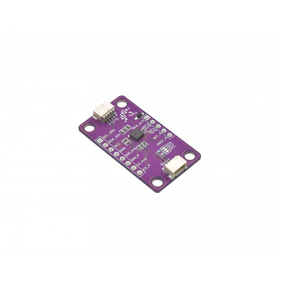

# Zio Qwiic 9DOF IMU LSM9DS1

> This product can be available for purchase [here](https://www.smart-prototyping.com/Zio-9DOF-IMU-LSM9DS1.html).

#### Description

The Zio 9DOF IMU LSM9DS1 is an all-around good pick for any orientation needs that don’t require on-sensor fusion. Like other 9-Degree-of-Freedom (9DOF) Inertial Measurement Units (IMU), it combines a 3-axis accelerometer, 3-axis gyroscope, 3-axis magnetometer in one tiny IC. Those sensors measure linear acceleration, angular velocity, and magnetic field strength, respectively. Additionally, there is an on-die temperature sensor that can be used to offset the effects of temperature on the other three sensor types.

With the right code to interpret all of this data, you can get a an excellent idea of the sensor package’s orientation in space, and the amplitude of the forces affecting it, even as it moves. You can use this to knowledge to stabilize a drone, a camera gimbal, or an electric unicycle. Or you can use it to capture and analyze the movements of a human or, for that matter, anything else that moves.

The sensor will output 10 different pieces of raw data: acceleration in x/y/z, angular rotation speed in x/y/z, magnetic force in x/y/z, and temperature. Combined, this information can be used to produce a clear image of an object’s movement and orientation. 

We’ve brought this solid little chip into the [Qwiic ecosystem](https://www.smart-prototyping.com/qwiic.html) by mounting it on a breakout board equipped with two Qwiic connectors. It can easily and quickly be daisy-chained to any other I2C boards in the system. We’ve opted to break out all of the pins for this sensor, making this a good general-purpose IMU breakout, and be used with SPI if you need a faster interface to your MCU.

There is a wide-variety of applications that this board can be used in such as AR, VR, robotic SLAM navigation, gaming, fitness tracking, context awareness (identification of the scenario in which a user is currently engaged), model rocket telemetry and more.

> Note: As with all of the Version 1.0 Zio Qwiic boards, this board has been produced with the I2C pull-ups disconnected by default. If there's a significant length of wire between this board and your MCU, you'll need to solder closed the solder jumpers (labeled SDA, 3v3 and SCL) to connect the pull-up resistors to VCC.

#### Specification

* Linear Acceleration Range: ±2/±4/±8/±16 g
* Magnetic Range: ±4/±8/±12/±16 gauss
* Angular Rate Range: ±245/±500/±2000 dps
* Data Output Resolution: 16-bit
* Communication Protocols: I2C, SPI
* IC: LSM9DS1
* I2C address:  Accelerometer and gyroscope: 0x6B, Magnetic: 0x1E
* Dimensions: 36.6x 20.7mm
* Weight: 1.8g (0.067oz)

#### Links

* [LSM9DS1 Datasheet](https://www.smart-prototyping.com/image/data/NOA-RnD/101893%209DOF%20IMU%20LSM9DS1/LSM9DS1_datasheet.pdf)
* [SparkFun LSM9DS1 Arduino Library](https://github.com/sparkfun/SparkFun_LSM9DS1_Arduino_Library)
* [Eagle files](https://github.com/ZIOCC/Qwiic_LSM9DS1)

> ###### About Zio
> Zio is a new line of open sourced, compact, and grid layout boards, fully integrated for Arduino and Qwiic ecosystem. Designed ideally for wearables, robotics, small-space limitations or other on the go projects. Check out other awesome Zio products [here](https://www.smart-prototyping.com/Zio).

> All Zio products are released under the [Creative Commons Attribution, Share-Alike License](https://creativecommons.org/licenses/by-sa/4.0/), and in accordance with the principles of the [Open Source Hardware Association's OSHW Statement of Principles 1.0 and OSHW Definition 1.0](https://www.oshwa.org/definition/).
